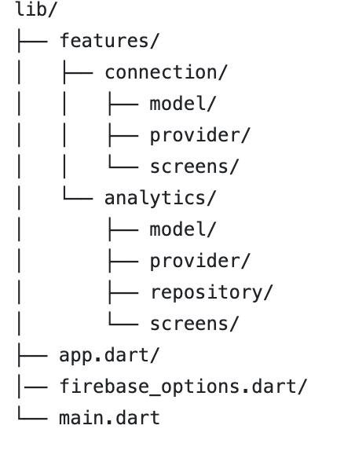
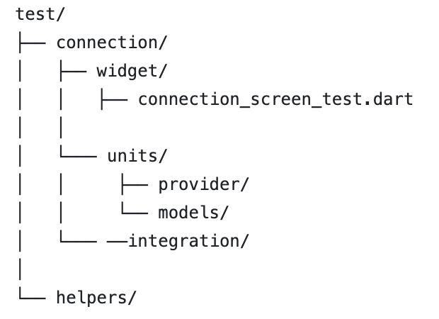
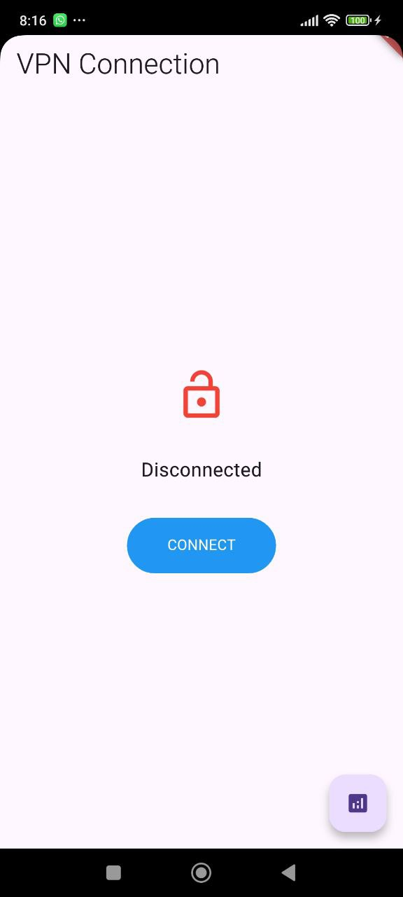
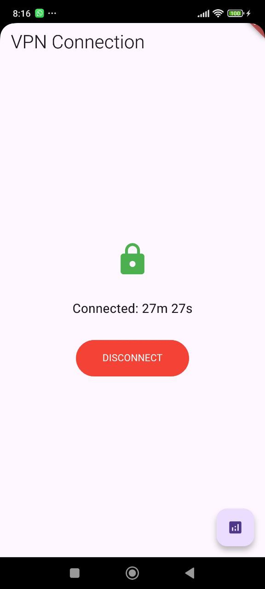
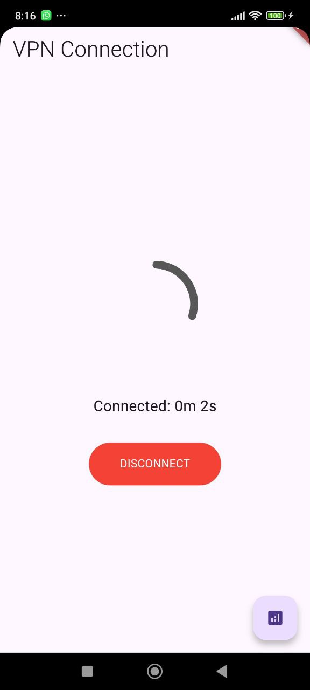
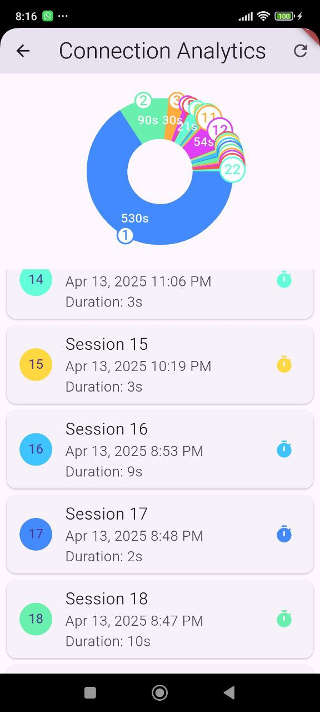

# VPN Приложение

![Логотип приложения] 

VPN-приложение на базе Flutter с управлением соединениями и отслеживанием аналитики.

## 📌 Основные функции

- **Мониторинг соединения**:
  - Время подключения
  - Стабильность соединения
- **Аналитика использования** (Firebase Analytics)
- **Адаптивный интерфейс** для мобильных устройств и планшетов
-  CHART

## 📸 Структура проекта

lib/
├── features/
│   ├── connection/
│   │   ├── model/
│   │   ├── provider/ 
│   │   └── screens/
│   └── analytics/
│       ├── model/
│       ├── provider/
│       ├── repository/
│       └── screens/
├── app.dart/
│── firebase_options.dart/
└── main.dart

## 📸 Структура тестирования
| 
test/
├── connection/
│   ├── widget/
│   │   ├── connection_screen_test.dart
│   │
│   └─── units/
│   │     ├── provider/
│   │     └── models/
│   └─── ──integration/
│
└── helpers/

## 🛠 Технологический стек

- **Flutter** (версия 3.0.0+)
- **Firebase**:
  - Firebase Analytics - сбор аналитики
    к
- **State management**: Riverpod
- **Локализация**: intl
- **Анимации**: Lottie
- **Анимации**: Lottie
- ** fl_chart: ^0.70.2
- **mocktail: ^1.0.3
- ** flutter_riverpod: ^2.4.9
- ** sizer: ^3.0.5
- ** build_runner

## 🔥 Firebase Analytics

Приложение интегрировано с **Firebase Analytics** для сбора следующих данных:

- Время использования приложения
- Частота подключений
- Продолжительность сессий
- География пользователей
## 📸 Скриншоты

| Главный экран | Аналитика | Настройки |
|--------------|-----------|-----------|
|  |
|  |
|  |
 | 

 

 
